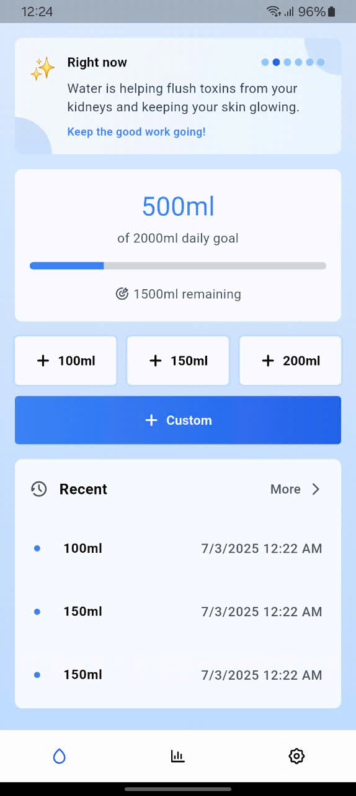
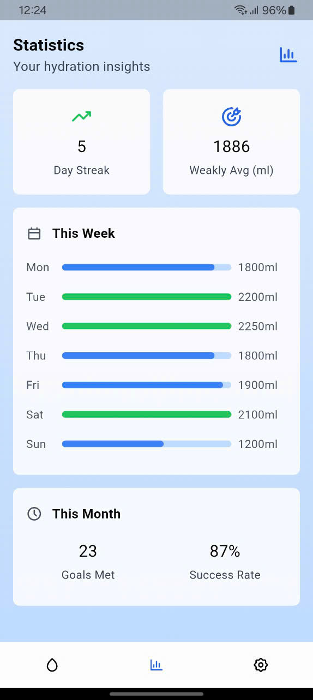
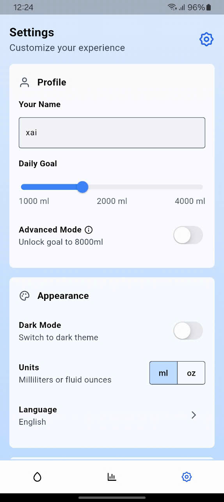
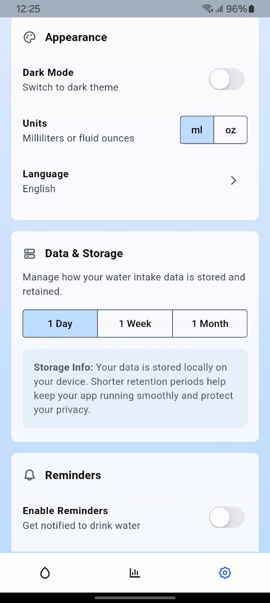
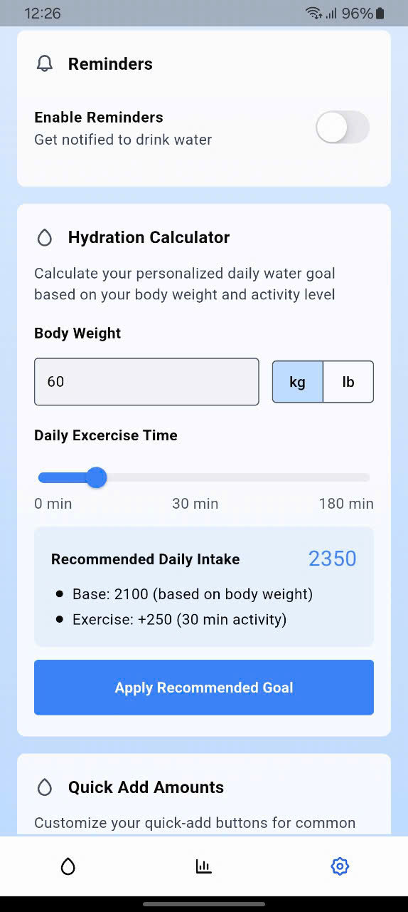
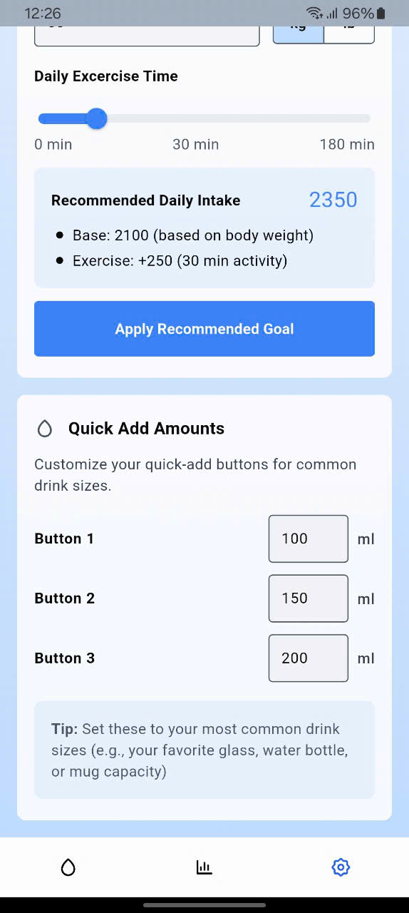
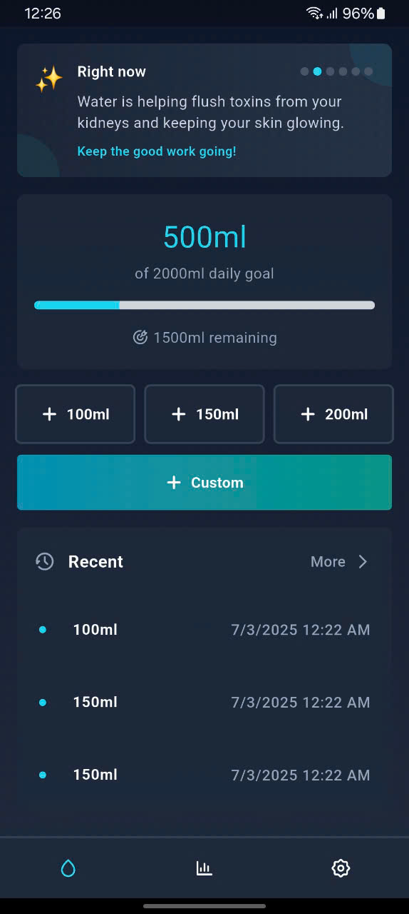
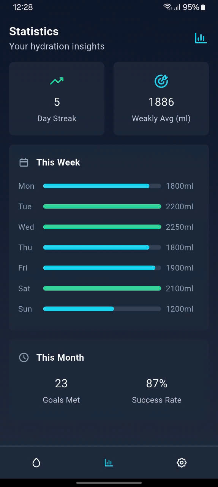
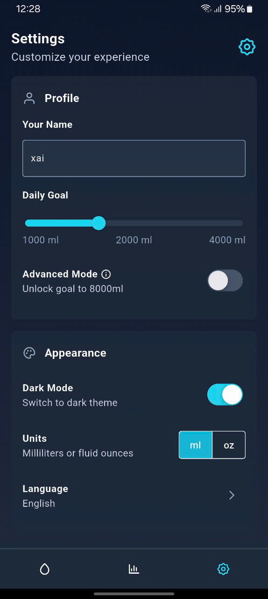

# Water Tracker App (unofficial name, in progress)

This is a lightweight mobile app  that helps users stay on top of their daily water intake. You can set your own hydration goals, log each drink, and track your progress over time with simple charts and stats.

## 🌟 Features

- Set and customize daily water intake goals
- Quick add options for fast logging
- Visual progress tracking with charts and statistics
- Weekly and monthly intake history
- Reminders to help you stay hydrated
- Support for multiple units (ml/oz, kg/lb)
- Light and dark themes

## 📋 Project Info

- **Layer-first** structure
- State management with **Bloc/Cubit**
- **Offline-first** experience with local storage
- **Firebase integration** with Crashlytics and Cloud Storage (planned)

## 📸 Screenshots

|     |     |     |
|:---:|:---:|:---:|
|  |  |  | 
|  |  |  | 
|  |  |  | 