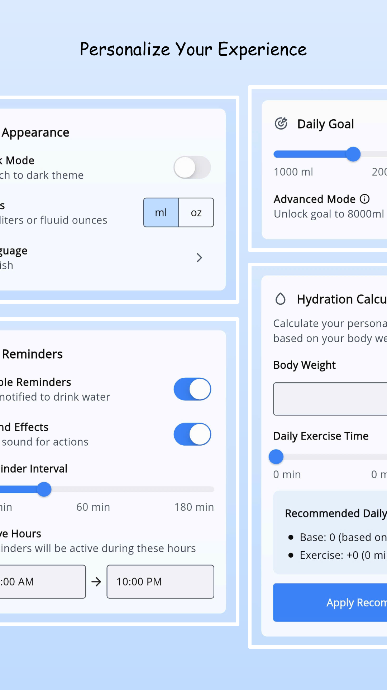
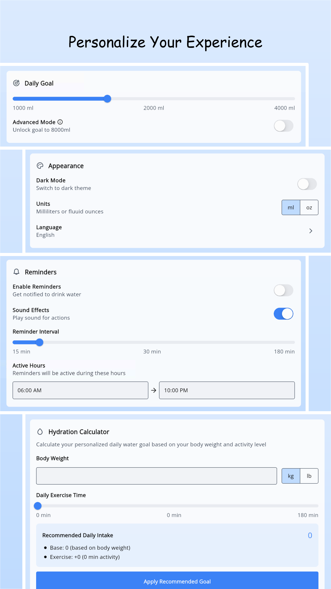

# Drink Log - Water Tracker

Drink Log - Water Tracker is a lightweight mobile app that helps users stay on top of their daily water intake. You can set your own hydration goals, log each drink, and track your progress over time with simple charts and stats.

## 🌟 Features

- Set and customize daily water intake goals.
- Quick add options for fast logging.
- Visual progress tracking with charts and statistics.
- Reminders to help you stay hydrated.
- Support for multiple units (ml/oz, kg/lb).
- Light and dark themes.
- Useful fact and benefit about water.
- Hydration calculator.

## 📸 Screenshots

|     |     |     |     |     |
|:---:|:---:|:---:|:---:|:---:|
|  |  |  |  |  |
|  |  |  |  |  | 